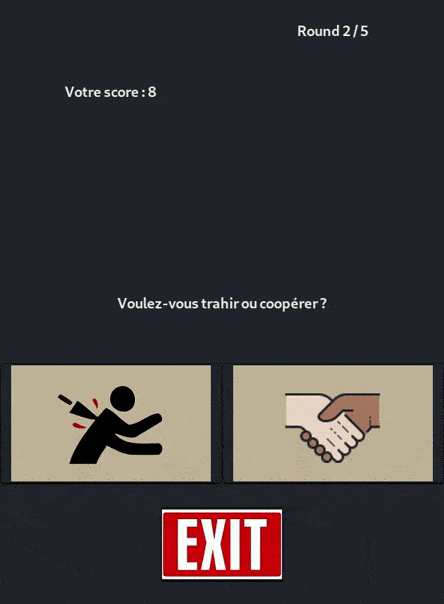

# Projet GRP3 - dilemme du prisonnier 

    

Le doctorant, qui n’est pas un développeur, a besoin d’accumuler des données expérimentales. Il a besoin que des volontaires jouent l’un contre l’autre un nombre de fois à définir, sans jamais savoir qui sont leurs adversaires. On définira une partie comme étant un certain nombre de rounds. Un round est défini comme une confrontation trahison-collaboration entre les deux volontaires.


<h1 align="center">
    
</h1>

## Pour commencer

Ce projet est basé sur l'utilisation de sockets (client-serveur) et de threads afin de mettre en place le jeu du dilemme du prisionnier en mutlijoueur sur un reseau local.
Contenu du projet : 
- socket-client (Le client contenant l'interface graphique)
- socket-server  (Le serveur qui aura pour tache de gérer les connexions ainsi que le jeu en lui même)

### Pré-requis
Afin de lancer des programmes avec gtk sous linux, il faudra installer certain packages : 
```bash
#debian:
sudo apt-get install libgtk-3-dev
sudo apt-get install build-essential gnome-devel

#phedora
sudo yum install gtk+-devel gtk2-devel gtk3-devel
```
### Installation et démarrage 

Récupération du projet git : 
```bash
# Récuperation du projet git
$ git clone https://gitlab.com/ClaireDsst/projetics.git
```
Lancement du server : 
```bash
# Aller vers le répertoire
$ cd socket-server

# Compilation du client
$ make all

# Executer le client
$ ./output/server
```
Lancement du client :
```bash
# Aller vers le répertoire
$ cd socket-client

# Compilation du client
$ make all

# Executer le client
$ ./output/client
```
## Développement

## Protocole

| Code | Client     | Server                                                   |
|------|------------|-------------|
|  1   |    	    |  CONNECTION_SERVER  |                                                                                       
|  3   | GAME_START |      		  		  |                                                         
|  4   | ROUND_START|  			  		  |                                                
|  5   |           		  | GET_CHOICE 	  |                                            
|  6   | SEND_ROUND_RESULT|  			  |
|  7   | SEND_GAME_RESULT |  			  |    


## Structure du jeu
### connection_client
Connexions client/serveur
```C
typedef struct {
    int action_id;
    char client_id;
} connection_client; 
```
### connection_status
 Confirmation de la connexion aux joueurs ainsi que l'id
```C
typedef struct {
    int action_id;
    bool status;     
    char message[SIZE_CHAR];     
} connection_status; 
```
### game_start
Annonce aux clients le début d'une nouvelle partie
```C
typedef struct {
    int action_id;
    int round_nb;
} game_start; 
```
### round_start
Annonce aux clients le début d’un nouveau round
```C
typedef struct {
    int action_id;
    int round_id;
} round_start; 
```
### send_choice
Contribue a l'envoie des choix du joueur 
```C
typedef struct {
    int action_id;
    bool coop;     
    int time_to_choose;    
} send_choice;
```
### send_round_result
Contribue à l'envoie du résultat du round 
```C
typedef struct {
    int action_id;
    bool win_or_lose;     
    int score;
} send_round_result;
```
### send_game_result
Contribue à l'envoie du résultat a la fin de la partie
```C
typedef struct {
    int action_id;
    int win_or_lose;     
    int score;     
} send_game_result;   

```
## Fabriqué avec
* [Visual code](https://code.visualstudio.com/) - IDE 
* [Glade GUI](https://glade.gnome.org/) - Création d'interface utilisateur 
* [Gitlab](https://gitlab.com/) - DevOps

## Auteurs

* **BRODIN Lucas** _alias_ [@lucas-brodin](https://gitlab.com/@lucas-brodin)
* **CHABERT Louis** _alias_ [@LoulouChabChab](https://gitlab.com/LoulouChabChab)
* **DOUSSOT Claire** _alias_ [@ClaireDsst](https://gitlab.com/ClaireDsst)
* **VERNIERE Loïc** _alias_ [@VERNIERELoic](https://gitlab.com/VERNIERELoic)
